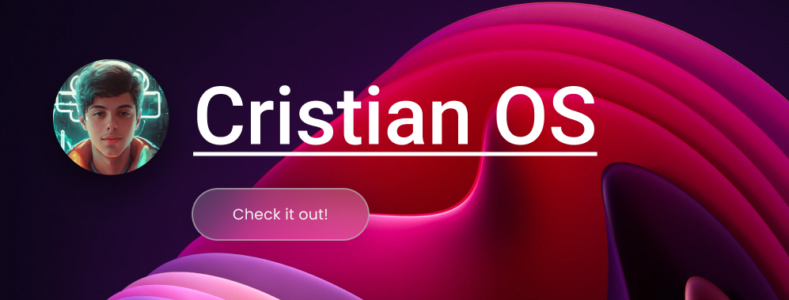

# 💻Cristian OS

Esse projeto simula um Sistema Operacional baseado no Windows. A aplicação fala um pouco sobre mim, meus _hobbies_, e minha vida.
Ele também se integra com a [Api do Github](https://docs.github.com/en/rest) para mostrar os repositórios mais recentes em que estou trabalhando.

Você pode aprender algo sobre mim, e se divertir um pouco navegando na aplicação!

> ⚠️ Sinta-se livre para [entrar em contato](https://portfolio-cristian-sbardelotto.vercel.app/contact/), e compartilhar seus **_feedbacks_** e **_insights_**, ou reportar um **_bug_**!

<p>
  <a href="#technologies">Tecnologias</a>&nbsp;&nbsp;&nbsp;|&nbsp;&nbsp;&nbsp;
  <a href="#learning">O que eu aprendi</a>&nbsp;&nbsp;&nbsp;|&nbsp;&nbsp;&nbsp;
  <a href="#installation">Instalação</a>&nbsp;&nbsp;&nbsp;|&nbsp;&nbsp;&nbsp;
  <a href="#deploy">Deploy</a>&nbsp;&nbsp;&nbsp;&nbsp;&nbsp;&nbsp;
</p>

<div id='technologies'></div>

## 🛠️ Tecnologias

Esse projeto foi feito com as seguintes tecnologias/bibliotecas:

- Typescript
- React
- React Router Dom
- TailwindCSS
- i18n
- Eslint
- Git & Github

<div id='learning'></div>

## 🧠 O que eu aprendi

Durante o desenvolvimento, eu descobri novas coisas, como:

- Utilização da [biblioteca i18n](https://react.i18next.com/)
- Composition Pattern -> [checar exemplo](./src/components/Application/)

<div id='installation'></div>

## 📤 Instalação

Primeiramente, você precisa **clonar o projeto** na sua máquina:

```bash
git clone https://github.com/cristian-sbardelotto/cristian-os
```

Depois disso, abra a pasta do projeto e **instale as dependências:**

```bash
npm install
# ou
yarn
# ou
pnpm install
```

Para **rodar o projeto** no seu navegador, use:

```bash
npm run dev
# ou
yarn dev
# ou
pnpm dev
```

<div id='deploy'></div>

## 🌎 Deploy

Para conferir o deploy, acesse https://cristian-os.vercel.app/

## Aproveite esse projeto!

Desenvolvido com 🧡 por **Cristian Sbardelotto**.

[](https://www.linkedin.com/in/cristian-k-sbardelotto/)
[](https://github.com/cristian-sbardelotto)
[](https://bit.ly/portfolioSbardelotto)
